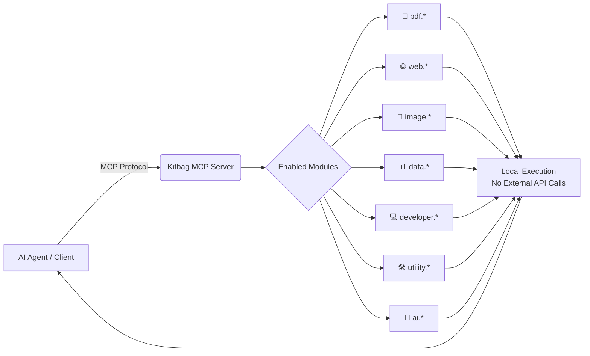

<div align="center">


<a href="https://github.com/syedtaj7/Kitbag-mcp/actions/workflows/ci.yml">
  
</a>
<a href="https://www.npmjs.com/package/kitbag-mcp">
  
</a>
<a href="https://opensource.org/licenses/MIT">
  
</a>
<a href="https://github.com/syedtaj7/Kitbag-mcp">
  
</a>
<a href="https://modelcontextprotocol.io">
  
</a>
<br/>


<br/><br/>

<a href="https://github.com/syedtaj7/Kitbag-mcp">
  
</a>

</div>

<br/>

> **Kitbag MCP** is a single, open-source [Model Context Protocol](https://modelcontextprotocol.io) server that bundles a curated library of **50+ high-value utility tools** — document converters, OCR processors, web scrapers, data formatters, and AI developer utilities — all in one place.
>
> Instead of installing, configuring, and paying to host a dozen single-purpose MCP servers, install **Kitbag MCP once** and selectively enable only the modules you need. It runs entirely on your machine: **zero hosting costs**, **no API keys**, **no server setup**.

<div align="center">


</div>

---

## 📖 Table of Contents

<details open>
<summary>Click to expand</summary>

- [🚀 Quick Start](#-quick-start-zero-config)
- [⚙️ Client Setup](#️-supported-clients-setup)
  - [Claude Desktop](#1-claude-desktop)
  - [Cursor](#2-cursor)
  - [Windsurf](#3-windsurf)
- [🎛️ Configuration](#️-configuration-flags--environment-variables)
- [🗺️ Tool Category Index](#️-tool-category-index)
- [📚 Complete Tool Directory](#-complete-tool-directory)
  - [📄 PDF Tools](#-pdf-tools-pdf)
  - [🌐 Web Scraping & Networking](#-web-scraping--networking-web)
  - [📸 Image & OCR Tools](#-image--ocr-tools-image)
  - [📊 Data Transformation](#-data-transformation-data)
  - [💻 Developer Utilities](#-developer-utilities-developer)
  - [🛠️ Utility Tools](#️-utility-tools-utility)
  - [🧠 AI Chunker](#-ai-chunker-ai)
- [🏗️ Architecture](#️-how-it-works)
- [🛠️ Local Development & Contributions](#️-local-development--contributions)
- [⚖️ License](#️-license)

</details>

---

## 🚀 Quick Start (Zero Config)

Run instantly using `npx` (Node.js required):

```bash
npx kitbag-mcp
```

### Expose Specific Modules (Saves LLM Context Tokens)

To prevent your AI agents from getting overwhelmed by tool options, enable only what you need:

```bash
# Enable PDF and Web scraping modules only
npx kitbag-mcp --enabled-modules pdf,web
```

<div align="center">
 ➜
 ➜
 ➜

</div>

---

## ⚙️ Supported Clients Setup

### 1. Claude Desktop

Add this entry to your `claude_desktop_config.json`:

```json
{
  "mcpServers": {
    "kitbag-mcp": {
      "command": "npx",
      "args": [
        "-y",
        "kitbag-mcp",
        "--enabled-modules",
        "pdf,web,image,data,utility,ai"
      ]
    }
  }
}
```

### 2. Cursor

1. Go to **Settings** → **Beta Features** → **MCP**.
2. Click **+ Add New MCP Server**.
3. Configure:
   - **Name**: `Kitbag MCP`
   - **Type**: `stdio`
   - **Command**: `npx -y kitbag-mcp --enabled-modules pdf,web,data,utility`

### 3. Windsurf

Add this entry to your `mcp_config.json`:

```json
{
  "mcpServers": {
    "kitbag-mcp": {
      "command": "npx",
      "args": [
        "-y",
        "kitbag-mcp"
      ],
      "env": {
        "KITBAG_ENABLED_MODULES": "pdf,web,data,utility"
      }
    }
  }
}
```

---

## 🎛️ Configuration Flags & Environment Variables

Kitbag MCP can be configured through CLI flags, environment variables, or a JSON config file — whichever fits your workflow.

| Configuration Source | Example Usage |
| :--- | :--- |
| **CLI Flags** | `--enabled-modules pdf,web` or `--enabled-tools utility.qr_generate` |
| **Env Variables** | `KITBAG_ENABLED_MODULES=pdf,web` or `KITBAG_ENABLED_TOOLS=utility.qr_generate` |
| **JSON Config** | A `kitbag-config.json` file in the current working directory, or via `--config /path/to/config.json` |

**`kitbag-config.json` schema:**

```json
{
  "enabledModules": ["pdf", "web", "image", "data", "utility", "ai", "developer"],
  "enabledTools": [],
  "defaultTimeoutMs": 30000,
  "maxPayloadSizeBytes": 52428800
}
```

---

## 🗺️ Tool Category Index

<div align="center">

| Category | Prefix | Tools | Focus |
| :---: | :---: | :---: | :--- |
| 📄 PDF | `pdf.*` | 6 | Parsing, conversion, merging, splitting |
| 🌐 Web | `web.*` | 7 | Scraping, feeds, sitemaps, DNS |
| 📸 Image & OCR | `image.*` | 5 | Resizing, compression, OCR, EXIF |
| 📊 Data | `data.*` | 8 | CSV / JSON / XML / YAML conversion |
| 💻 Developer | `developer.*` | 11 | Formatting, linting, diffing, decoding |
| 🛠️ Utility | `utility.*` | 12 | Crypto, QR, networking, archives |
| 🧠 AI | `ai.*` | 1 | Text chunking for LLM ingestion |

</div>

---

## 📚 Complete Tool Directory

### 📄 PDF Tools (`pdf.*`)

High-performance local PDF parsers and manipulators.

| Tool Name | Description | Example Agent Prompt |
| :--- | :--- | :--- |
| `pdf.convert_to_text` | Extract raw text from a PDF document. | *"Extract the text from reports/invoice.pdf"* |
| `pdf.convert_to_markdown` | Parse PDF and format it into clean Markdown. | *"Convert layout of guide.pdf to markdown"* |
| `pdf.extract_images` | Extract raw image assets embedded inside a PDF. | *"Extract all images from slide_deck.pdf"* |
| `pdf.extract_tables` | Extract structured table data from PDF pages. | *"Pull out all tables from financial_report.pdf"* |
| `pdf.merge` | Merge multiple PDF files together in order. | *"Merge doc1.pdf and doc2.pdf into a single file"* |
| `pdf.split` | Split specific page ranges from a PDF. | *"Give me page 1 to 3 from main_guide.pdf"* |

---

### 🌐 Web Scraping & Networking (`web.*`)

Interact with raw web documents and query networking systems.

| Tool Name | Description | Example Agent Prompt |
| :--- | :--- | :--- |
| `web.to_markdown` | Scrape a webpage, clean clutter, and convert to Markdown. | *"Convert the article at https://example.com/blog to markdown"* |
| `web.extract_metadata` | Extract title, description, OG tags, and JSON-LD data. | *"Get metadata for URL https://news.ycombinator.com"* |
| `web.extract_links` | Scrape a webpage and list internal and external links. | *"Find all external links on the Wikipedia page for AI"* |
| `web.rss_parser` | Parse an RSS or Atom feed XML URL into JSON. | *"Get the latest feed items from https://github.blog/feed/"* |
| `web.sitemap_generator` | Fetch and parse a sitemap.xml URL, extracting all URLs. | *"Fetch all URLs in the sitemap for google.com"* |
| `web.dns_lookup` | Perform DNS resolution (A, AAAA, MX, TXT, etc.). | *"Do an MX record lookup for domain gmail.com"* |
| `web.youtube_transcript` | Extract text transcripts and captions with timestamps. | *"Get the transcript for https://www.youtube.com/watch?v=dQw4w9"* |

---

### 📸 Image & OCR Tools (`image.*`)

Manipulate images and extract text locally.

| Tool Name | Description | Example Agent Prompt |
| :--- | :--- | :--- |
| `image.ocr` | Extract text from an image locally using Tesseract OCR. | *"Extract text from screenshot.png"* |
| `image.resize` | Resize an image's dimensions (width and height). | *"Resize avatar.png to be 200x200 pixels"* |
| `image.compress` | Compress image file size with custom quality. | *"Compress banner.jpg to 80% quality"* |
| `image.convert_format`| Convert images between formats (PNG, JPEG, WebP, etc.). | *"Convert logo.png to webp format"* |
| `image.exif_metadata` | Extract EXIF camera and location metadata from image files. | *"Show me the GPS coordinates and camera model of photo.jpg"* |

---

### 📊 Data Transformation (`data.*`)

Fast, offline conversion between standard data formats.

| Tool Name | Description | Example Agent Prompt |
| :--- | :--- | :--- |
| `data.csv_to_json` | Convert CSV file or raw text to JSON. | *"Parse users.csv and return it as JSON"* |
| `data.json_to_csv` | Convert JSON array of objects to CSV output. | *"Convert this array of users to a CSV table"* |
| `data.xml_to_json` | Convert XML documents to structured JSON objects. | *"Convert this configuration XML text to JSON"* |
| `data.json_to_xml` | Convert JSON objects to clean XML output. | *"Export this JSON object into XML tag format"* |
| `data.yaml_to_json` | Convert YAML documents to JSON. | *"Convert Kubernetes config yaml to JSON"* |
| `data.json_to_yaml` | Convert JSON objects to clean YAML format. | *"Format this database JSON block as YAML"* |
| `data.deduplicate` | Deduplicate arrays of JSON objects by a specific key. | *"Remove duplicates from this list of user objects by ID"* |
| `data.diff_arrays` | Compare two JSON arrays and list differences. | *"Compare array A and B and show me additions and removals"* |

---

### 💻 Developer Utilities (`developer.*`)

Standard formats, validation, and layout tools for developers.

| Tool Name | Description | Example Agent Prompt |
| :--- | :--- | :--- |
| `developer.json_formatter`| Format and prettify JSON strings with custom indentation. | *"Prettify this JSON string using 4 spaces indent"* |
| `developer.jwt_decoder` | Decode JWT tokens to read payload/header claims. | *"Decode this JWT token: eyJhbGciOiJI..."* |
| `developer.sql_formatter` | Format SQL strings for multiple database dialects. | *"Format this messy select query for PostgreSQL"* |
| `developer.mermaid_generate`| Create Mermaid diagrams (flowcharts, sequence, etc.). | *"Generate a flowchart diagram representing this user flow"* |
| `developer.openapi_parser`| Parse and format OpenAPI/Swagger specification files. | *"List the endpoints and request schemas of this openapi.yaml"* |
| `developer.regex_tester` | Test regular expression matches on text. | *"Test if this email regex matches test@example.com"* |
| `developer.cron_parser` | Parse Cron expressions and list upcoming execution times. | *"Tell me when the cron job '0 9 * * 1-5' runs next"* |
| `developer.diff_files` | Show line differences between text files. | *"Show me the diff between fileA.txt and fileB.txt"* |
| `developer.diff_json` | Show differences between JSON schemas. | *"Highlight structural changes between config1.json and config2.json"* |
| `developer.code_detector` | Detect programming language and syntax structure. | *"What programming language is this code written in?"* |
| `developer.markdown_lint` | Lint and validate formatting in Markdown files. | *"Find styling errors or trailing spaces in index.md"* |

---

### 🛠️ Utility Tools (`utility.*`)

System, network, and cryptography helper functions.

| Tool Name | Description | Example Agent Prompt |
| :--- | :--- | :--- |
| `utility.qr_generate` | Generate a QR code as a file or base64 Data URL. | *"Create a QR code pointing to https://github.com"* |
| `utility.qr_read` | Read and decode a QR code from a file or stream. | *"What does the QR code inside code.png say?"* |
| `utility.base64_encode` | Convert strings/files to base64 format. | *"Base64 encode the string 'Hello World'"* |
| `utility.base64_decode` | Decode base64 strings back to text. | *"Decode 'SGVsbG8gV29ybGQ='"* |
| `utility.uuid_generate` | Generate secure UUIDs (v4/v1) or secure passwords. | *"Generate a secure password of length 16"* |
| `utility.file_hash` | Compute md5, sha1, or sha256 hashes of text/data. | *"Calculate the sha256 hash of this string"* |
| `utility.email_validate` | Validate syntax and verify MX records of emails. | *"Check if support@github.com has valid MX records"* |
| `utility.ssl_check` | Query certificate expiration date and info for any domain. | *"Check when the SSL certificate for google.com expires"* |
| `utility.unit_convert` | Convert values between physical or data units. | *"Convert 1024 megabytes to gigabytes"* |
| `utility.url_parser` | Break down URLs into protocol, domain, params, etc. | *"Parse this search query URL into its components"* |
| `utility.zip_create` | Compress files or folders into a single ZIP archive. | *"Compress source/ and assets/ into workspace.zip"* |
| `utility.zip_extract` | Extract a ZIP archive to a destination folder. | *"Extract files from archive.zip into build_dir/"* |

---

### 🧠 AI Chunker (`ai.*`)

Segment large text structures dynamically for ingestion.

| Tool Name | Description | Example Agent Prompt |
| :--- | :--- | :--- |
| `ai.text_chunker` | Chunk long text using paragraph/sentence/word strategies. | *"Chunk this text document into 500-char sizes with a 50-char overlap"* |

---

## 🏗️ How It Works



Kitbag MCP runs as a single local process. Your AI client talks to it over the standard MCP protocol, and only the modules you enable are exposed as tools — keeping token usage low and your workflow fast and private.

---

## 🛠️ Local Development & Contributions

Every tool is fully self-contained. Adding a new tool is as simple as creating a folder inside `src/tools/<category>/<tool_name>/`.

### Contribution Requirements

| File | Purpose |
| :--- | :--- |
| `tool.ts` | The main execution code, exporting a `ToolDefinition`. |
| `README.md` | Direct tool documentation and parameter descriptions. |
| `example.json` | Sample inputs and expected outputs. |
| `tests.ts` | Self-contained unit tests using mocks where necessary to run instantly. |

### Command Guide

```bash
# Build compiler output
npm run build

# Run all 50 module tests
npm test

# Run real-life execution checks (makes live API and DNS requests)
npx tsx src/tests/run_real_life.ts
```

<div align="center">
<a href="https://github.com/syedtaj7/Kitbag-mcp/issues"></a>
<a href="https://github.com/syedtaj7/Kitbag-mcp/pulls"></a>
<a href="https://github.com/syedtaj7/Kitbag-mcp/discussions"></a>
</div>

---

## ⚖️ License

Distributed under the **MIT License**. See [`LICENSE`](./LICENSE) for more information. Fully open-source and free to adapt for personal or commercial use.

<div align="center">


**⭐ If Kitbag MCP saves you time, consider starring the repo! ⭐**

</div>
